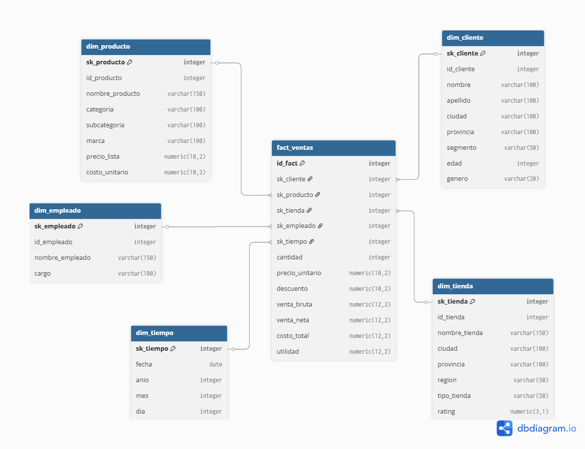

# 📊 ETL Pipeline & Data Warehouse (KNIME + PostgreSQL)

## 🚀 Overview

This project implements a complete **ETL pipeline** using **KNIME**, integrating multiple heterogeneous data sources and loading the transformed data into a **Data Warehouse** designed using a **star schema**.

---

## 🧱 Architecture

### Data Sources
- CSV (sales data)
- MySQL (customers)
- PostgreSQL (products)
- MongoDB (stores)

### Data Warehouse
- PostgreSQL
- Star Schema design:
  - fact_ventas
  - dim_cliente
  - dim_producto
  - dim_tienda
  - dim_tiempo
  - dim_empleado

---

## ⚙️ ETL Process

### Extract
- CSV Reader
- DB Query Reader
- MongoDB Connector

### Transform
- Data integration (joins)
- Data cleaning
- Aggregations
- Time extraction
- Business metrics calculation

### Load
- DB Writer nodes to PostgreSQL (`dw_retail`)

---

## 📊 Data Warehouse Schema



---

## 📂 Project Structure
etl_knime_dw/
│
├── data/
├── diagrams/
├── notebooks/
├── sql/
├── workflows/
├── docker-compose.yml

---
## 🧪 Validation

Example SQL queries:

```sql
SELECT COUNT(*) FROM fact_ventas;
SELECT COUNT(*) FROM dim_cliente;
```
---
## **🧠 Key Concepts**
ETL (Extract, Transform, Load)
Data integration from heterogeneous sources
Data cleaning & transformation
Star schema design
OLAP-ready Data Warehouse

---
📌 Author

Gabriel Betancourt
